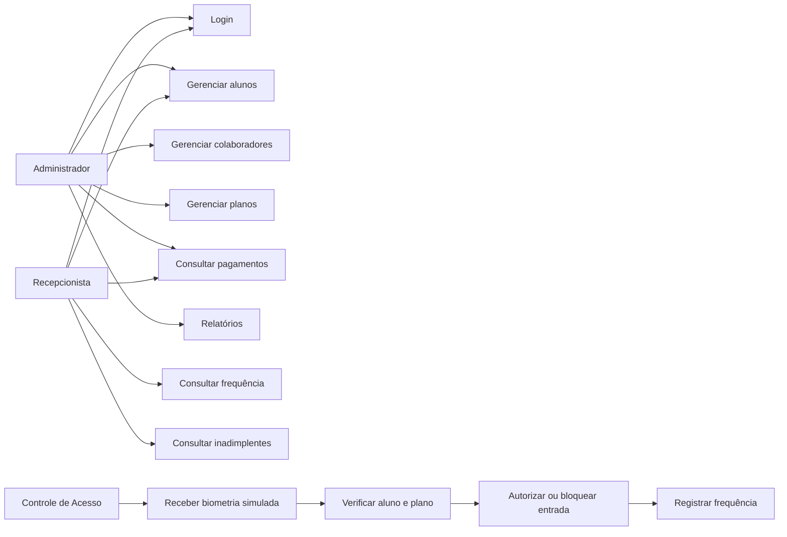
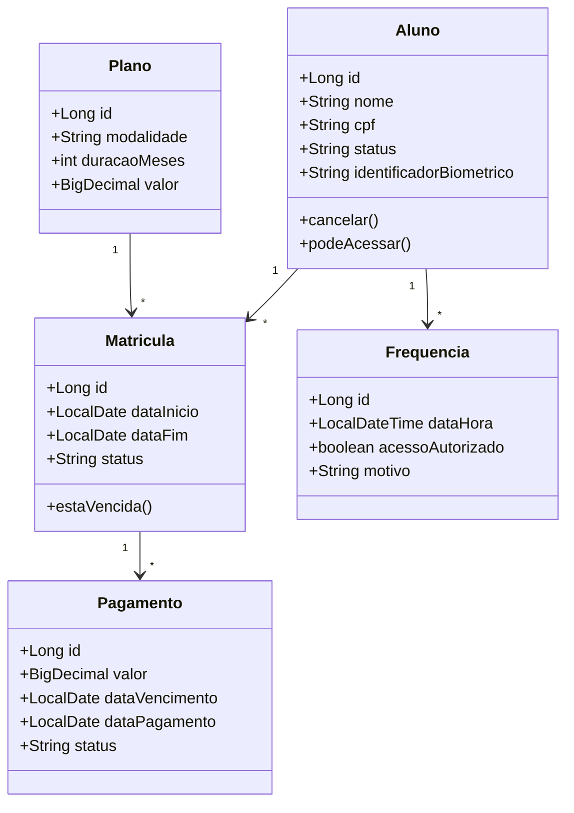

# Diagramas UML

## Casos de uso
Cole o código abaixo em um editor Mermaid compatível:

```mermaid
flowchart LR
A[Administrador] --> L[Login]
A --> AL[Gerenciar alunos]
A --> C[Gerenciar colaboradores]
A --> P[Gerenciar planos]
A --> PG[Consultar pagamentos]
A --> R[Relatórios]
RCP[Recepcionista] --> L
RCP --> AL
RCP --> PG
RCP --> F[Consultar frequência]
RCP --> I[Consultar inadimplentes]
AC[Controle de Acesso] --> B[Receber biometria simulada]
B --> V[Verificar aluno e plano]
V --> E[Autorizar ou bloquear entrada]
E --> FQ[Registrar frequência]
```

## Classes

```mermaid
classDiagram
class Aluno {
 +Long id
 +String nome
 +String cpf
 +String status
 +String identificadorBiometrico
 +cancelar()
 +podeAcessar()
}
class Plano {
 +Long id
 +String modalidade
 +int duracaoMeses
 +BigDecimal valor
}
class Matricula {
 +Long id
 +LocalDate dataInicio
 +LocalDate dataFim
 +String status
 +estaVencida()
}
class Pagamento {
 +Long id
 +BigDecimal valor
 +LocalDate dataVencimento
 +LocalDate dataPagamento
 +String status
}
class Frequencia {
 +Long id
 +LocalDateTime dataHora
 +boolean acessoAutorizado
 +String motivo
}
Aluno "1" --> "*" Matricula
Plano "1" --> "*" Matricula
Matricula "1" --> "*" Pagamento
Aluno "1" --> "*" Frequencia
```
